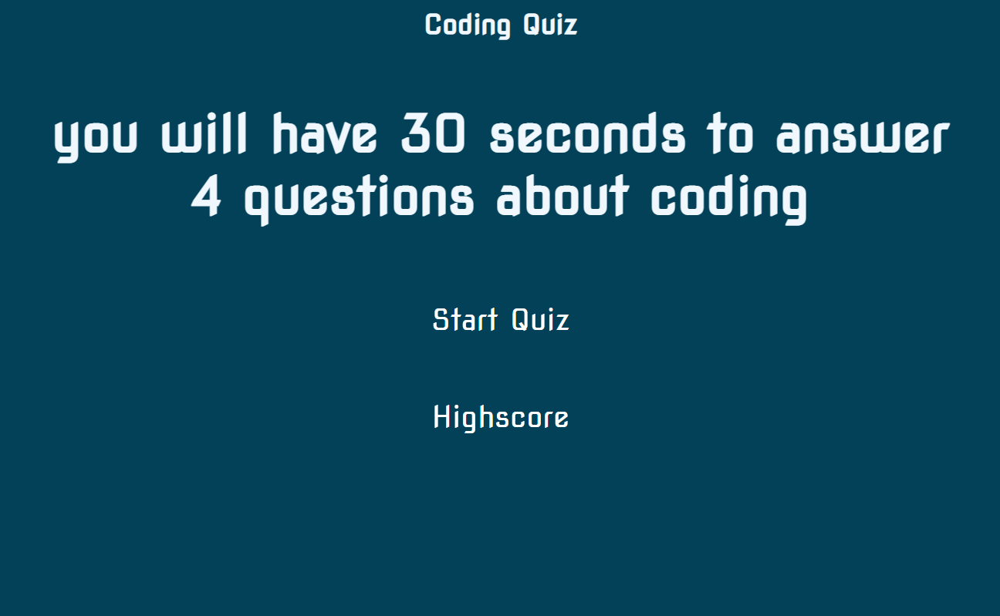

# Web-APIs-Challenge-Code-Quiz

## By Zach Hanson

#### Purpose
This website relies heavily on Javascript to bring you The coding quiz! Put your coding skills to the test. Answer as many questions as you can before time runs out.
A great game while you are bored at work or just wanna have fun. Check and see how you rank against other players and compete for bragging rights. click the link below to play!

## Usage

1. Using a browser open up the link
2. Test your skills by taking the coding quiz

## Technologies Used

JavaScript,
HTML, 
CSS,

## Credits

## website
Check it out for yourself! https://zachitp.github.io/Code-Quiz/

## Support
 

## License
MIT Copyright (c) Zach Hanson

Permission is hereby granted, free of charge, to any person obtaining a copy of this software and associated documentation files (the "Software"), to deal in the Software without restriction, including without limitation the rights to use, copy, modify, merge, publish, distribute, sublicense, and/or sell copies of the Software, and to permit persons to whom the Software is furnished to do so, subject to the following conditions:

The above copyright notice and this permission notice shall be included in all copies or substantial portions of the Software.

THE SOFTWARE IS PROVIDED "AS IS", WITHOUT WARRANTY OF ANY KIND, EXPRESS OR IMPLIED, INCLUDING BUT NOT LIMITED TO THE WARRANTIES OF MERCHANTABILITY, FITNESS FOR A PARTICULAR PURPOSE AND NONINFRINGEMENT. IN NO EVENT SHALL THE AUTHORS OR COPYRIGHT HOLDERS BE LIABLE FOR ANY CLAIM, DAMAGES OR OTHER LIABILITY, WHETHER IN AN ACTION OF CONTRACT, TORT OR OTHERWISE, ARISING FROM, OUT OF OR IN CONNECTION WITH THE SOFTWARE OR THE USE OR OTHER DEALINGS IN THE SOFTWARE.